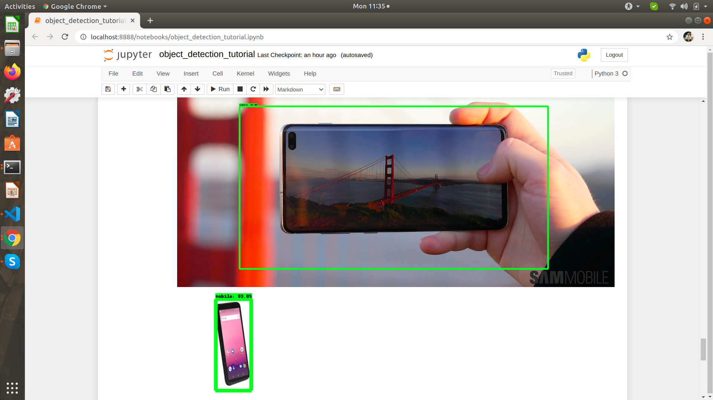

# Create custom object detector SSD Mobilenet Model using Tensorflow 2

Here, we will create SSD-MobileNet-V2 model for smart phone deteaction. We are going to use tensorflow-gpu 2.2 for this. I am using python version 3.7.7.


<h2> Workspace Preparation and Tensorflow Installation </h2>

Create a workspace, for this create a directory `tensorflow_model`.
$mkdir tensorflow_model

```
$cd tensorflow_model

```

Create virtual environment for workspace. 

```
$python3 -m venv env
$source env/bin/activate

```

Upgrade your pip. pip version must be greate than version 19.0

```
pip install --upgrade pip
```

Installling tensorflow

```
pip install tensorflow-gpu==2.2

```
Installing few other related libraries and dependencies

```
pip install pillow
pip install lxml
pip install jupyter
pip install matplotlib

```


<h2> Data Gathering </h2>


Create directory `images` and  `images/train` , `images/test`

```
$mkdir tensorflow_model/images
$mkdir tensorflow_model/images/train
$mkdir tensorflow_model/images/test

```

Upload training images and test images to `images/training` and `images/test` respectively

<h2> Image labelling </h2>

Dataset ( images ) labelling is required for the training purpose. Install labelImg for the same.

Clone labelImg repository

```
$git clone https://github.com/tzutalin/labelImg.git
$cd labelImg

```

Install the dependencies required for labelImg

```
$apt-get install pyqt5-dev-tools
$pip install -r requirements/requirements-linux-python3.txt

```

run the labelImg

```
python labelImg.py

```

**For detail usages of lableImg please refer to its documentation.**

Make sure to store the xml file and images in same directory for traning and test data. I have stored the xml information of each images of images/train and images/test in their directory respectively.

<h2> Preparation before training the model </h2>

create directory data in workspace (tensorflow_model/data) and from workspace home folder run the xml-to-csv.py script

```
$mkdir data
$python xml-to-csv.python

```

This will create test_labels.csv and train_lables.csv in `tensorflow/data` directory. Please verify the images path mention in the csv files are correct and absolute path is mentioned.


clone tensorflow models repository in the workspace `tensorflow_model` and install related dependencies

```
$ git clone https://github.com/tensorflow/models.git
$ cd models/reasearch
$ protoc object_detection/protos/*.proto --python_out=.
$ pip install tf_slim
$ pip install pandas

```

Copy `models/research/official` and `models/research/object_detection` from `tensorflow_model/models` to workspace  home directory that is `tensorflow_model`

```
cp -r models/research/official .
cp -r models/research/object_detection   .

```

Generate the record file required for pipeline configuration

```
$python generate_tfrecord.py --csv_input=data/train_labels.csv --output_path=data/train.record
$python generate_tfrecord.py --csv_input=data/test_labels.csv --output_path=data/test.record

```

<h2> Create lable map file  </h2>

```
$mkdir training
$cd training
$touch object-detection.pbxt
```
add below line in the the file `object-detection.pbxt`

```
item {
  id: 1
  name: 'mobile'
}

```

Since I am creating the model for mobile object detection. I have given name `mobile`. you can add multiple items if you want to train your model with multiple objects  like below

```
item {
  id: 1
  name: 'mobile'
}

item {
  id: 2
  name: 'laptop'
}

```
exit from training directory to workspace home directory `tensorflow_model`

<h2> Download example model </h2>

Download the example model `ssd_mobilenet_v2_320x320_coco17_tpu-8.tar.gz` and extract in workspace home directory

```
$wget http://download.tensorflow.org/models/object_detection/tf2/20200711/ssd_mobilenet_v2_320x320_coco17_tpu-8.tar.gz
$tar -xvzf sd_mobilenet_v2_320x320_coco17_tpu-8.tar.gz

```
change the pipeline config accordingly. The changes I made in the config file is higlighted in bold

```
model {
  ssd {
    num_classes: **1**
    image_resizer {
      fixed_shape_resizer {
        height: 300
        width: 300
      }
    }
    feature_extractor {
      type: "ssd_mobilenet_v2_keras"
      depth_multiplier: 1.0
      min_depth: 16
      conv_hyperparams {
        regularizer {
          l2_regularizer {
            weight: 3.9999998989515007e-05
          }
        }
        initializer {
          truncated_normal_initializer {
            mean: 0.0
            stddev: 0.029999999329447746
          }
        }
        activation: RELU_6
        batch_norm {
          decay: 0.9700000286102295
          center: true
          scale: true
          epsilon: 0.0010000000474974513
          train: true
        }
      }
      override_base_feature_extractor_hyperparams: true
    }
    box_coder {
      faster_rcnn_box_coder {
        y_scale: 10.0
        x_scale: 10.0
        height_scale: 5.0
        width_scale: 5.0
      }
    }
    matcher {
      argmax_matcher {
        matched_threshold: 0.5
        unmatched_threshold: 0.5
        ignore_thresholds: false
        negatives_lower_than_unmatched: true
        force_match_for_each_row: true
        use_matmul_gather: true
      }
    }
    similarity_calculator {
      iou_similarity {
      }
    }
    box_predictor {
      convolutional_box_predictor {
        conv_hyperparams {
          regularizer {
            l2_regularizer {
              weight: 3.9999998989515007e-05
            }
          }
          initializer {
            random_normal_initializer {
              mean: 0.0
              stddev: 0.009999999776482582
            }
          }
          activation: RELU_6
          batch_norm {
            decay: 0.9700000286102295
            center: true
            scale: true
            epsilon: 0.0010000000474974513
            train: true
          }
        }
        min_depth: 0
        max_depth: 0
        num_layers_before_predictor: 0
        use_dropout: false
        dropout_keep_probability: 0.800000011920929
        kernel_size: 1
        box_code_size: 4
        apply_sigmoid_to_scores: false
        class_prediction_bias_init: -4.599999904632568
      }
    }
    anchor_generator {
      ssd_anchor_generator {
        num_layers: 6
        min_scale: 0.20000000298023224
        max_scale: 0.949999988079071
        aspect_ratios: 1.0
        aspect_ratios: 2.0
        aspect_ratios: 0.5
        aspect_ratios: 3.0
        aspect_ratios: 0.33329999446868896
      }
    }
    post_processing {
      batch_non_max_suppression {
        score_threshold: 9.99999993922529e-09
        iou_threshold: 0.6000000238418579
        max_detections_per_class: 100
        max_total_detections: 100
        use_static_shapes: false
      }
      score_converter: SIGMOID
    }
    normalize_loss_by_num_matches: true
    loss {
      localization_loss {
        weighted_smooth_l1 {
          delta: 1.0
        }
      }
      classification_loss {
        weighted_sigmoid_focal {
          gamma: 2.0
          alpha: 0.75
        }
      }
      classification_weight: 1.0
      localization_weight: 1.0
    }
    encode_background_as_zeros: true
    normalize_loc_loss_by_codesize: true
    inplace_batchnorm_update: true
    freeze_batchnorm: false
  }
}
train_config {
  batch_size: **10**
  data_augmentation_options {
    random_horizontal_flip {
    }
  }
  data_augmentation_options {
    ssd_random_crop {
    }
  }
  sync_replicas: true
  optimizer {
    momentum_optimizer {
      learning_rate {
        cosine_decay_learning_rate {
          learning_rate_base: 0.800000011920929
          total_steps: 50000
          warmup_learning_rate: 0.13333000242710114
          warmup_steps: 2000
        }
      }
      momentum_optimizer_value: 0.8999999761581421
    }
    use_moving_average: false
  }
  fine_tune_checkpoint: **"ssd_mobilenet_v2_320x320_coco17_tpu-8/checkpoint/ckpt-0"**
  num_steps: 50000
  startup_delay_steps: 0.0
  replicas_to_aggregate: 8
  max_number_of_boxes: 100
  unpad_groundtruth_tensors: false
  fine_tune_checkpoint_type: **"detection"**
  fine_tune_checkpoint_version: V2
}
train_input_reader {
  label_map_path: **"training/object-detection.pbxt"**
  tf_record_input_reader {
    input_path: **"data/train.record"**
  }
}
eval_config {
  metrics_set: "coco_detection_metrics"
  use_moving_averages: false
}
eval_input_reader {
  label_map_path: **"training/object-detection.pbxt"**
  shuffle: false
  num_epochs: 1
  tf_record_input_reader {
    input_path: **"data/test.record"**
  }
}

```

<h2> Train your model </h2>

Copy and add model_main_tf2.py  and exporter_main_v2.py file in the workspace home directory. I have modified the file to use GPU. 


```
cp object_detection/model_main_tf2.py  .
cp object_detection/exporter_main_v2.py  .

```

Install dependendecies if any dependency is missing

```
pip install pycocotools
pip install scipy
pip install dataclasses
pip install pyyaml

```


Create directory `trained-checkpoint`. In this directory we will store all the checkpoint during the model training which will be later used to export model

```
$mkdir tensorflow_model/trained-checkpoint

```

Now train your model. This step will take sometime and it depends on how large your dataset. I have trained my model on around 100 images and it took around 1 hour.

```
$python model_main_tf2.py --pipeline_config_path=ssd_mobilenet_v2_320x320_coco17_tpu-8/pipeline.config --model_dir=trained-checkpoint --alsologtostderr --num_train_steps=50000 --sample_1_of_n_eval_examples=1 --num_eval_steps=1

```

<h2> Export the model </h2>

create directory `tensorflow_model/exported-model`

```
$ mkdir tensorflow_model/exported-model

```


Run the below command to export your model in `tensorflow_model/exported-model directory`

```
$python exporter_main_v2.py --input_type image_tensor --pipeline_config_path ./ssd_mobilenet_v2_320x320_coco17_tpu-8/pipeline.config --trained_checkpoint_dir ./trained-checkpoint --output_directory exported-model/mobile-model

```

<h2> Test your model </h2>

copy the object_detection_tutorial.ipynb in workspace home directory and run the jupter notebook

```
$ cp object_detection/colab_tutorials/object_detection_tutorial.ipynb  .
$ jupyter notebook

```

Run the object_detection_tutorial.ipynb file. Make changes accordingly if you are using other directory structure.

